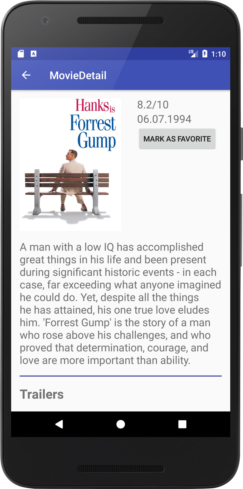
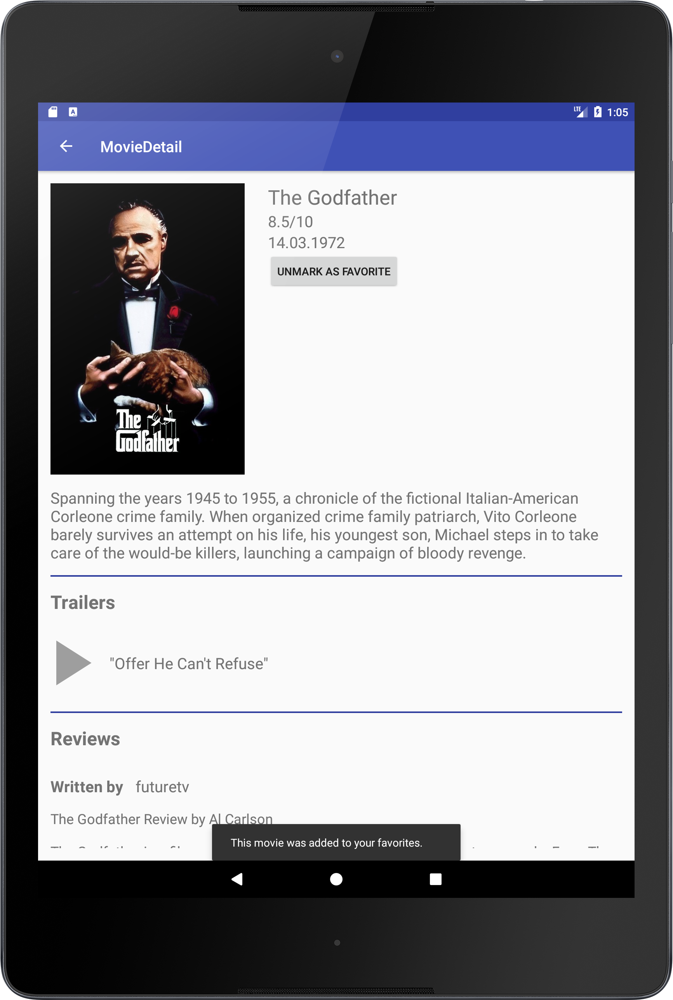
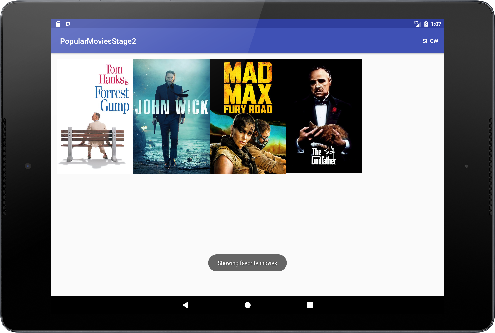

# PopularMoviesStage2
Simple movie listing Android app allowing users to discover movies. This is  a continuation of [this project](https://github.com/DenisDavidek/PopularMoviesStage1) and it is also a Project 2 of Udacity's Android Developer Nanodegree.


**Features:**
- Discover top rated and popular movies
- Basic UI optimizations for phones and tablets
- UI designed using Material Design
- Watch movie trailers
- Read movie reviews from other users
- Mark movies as your favorites and learn about them offline

# Screenshots

 </img>  </img>
 </img>  
 </img>

# Developer Setup
Clone or download this repository and follow requirements and API KEY sections to get a successful build of this app.
## Requirements

 - Java 7
 - Latest version of Android Studio, Android Build Tools and Gradle
 

## API KEY

This app uses themoviedb.org API to get a releavant movie information and posters. 
You must provide your own [API Key](https://www.themoviedb.org/documentation/api) in order to build the app.

Create gradle.properties file(if it doesn't exist) and put your API key inside this file:

```
API_KEY="xYz123"
```
